# 1. Criando um projeto que suporte .NET e uma programação C#

- O primeiro passo é configurar o ambiente:
    - Fazer o download do VS Community 2019:
        - [Downloads - Visual Studio Subscriptions Portal](https://my.visualstudio.com/Downloads?q=visual%20studio%202019&wt.mc_id=o~msft~vscom~older-downloads)
        
        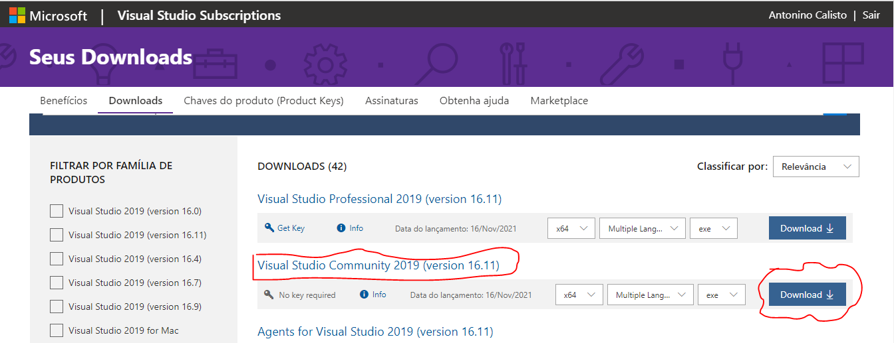
        
    - Durante a instalação deve-se escolher as funcionalidades de download dos pacotes:
        - [ASP.NET](http://asp.net/) e desenvolvimento Web;
        - Desenvolvimento multiplataforma com .NET Core.
    - Fazer o download do VS Code 2019:
        - [Visual Studio Code - Code Editing. Redefined](https://code.visualstudio.com/)
        
        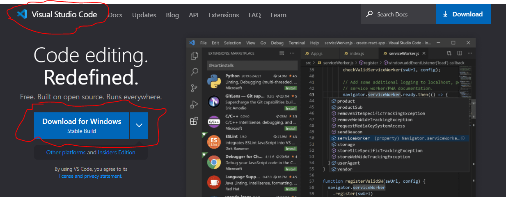
        
    - Fazer o download do SDK:
        - [Download .NET 5.0 (Linux, macOS, and Windows) (microsoft.com)](https://dotnet.microsoft.com/en-us/download/dotnet/5.0)
        
        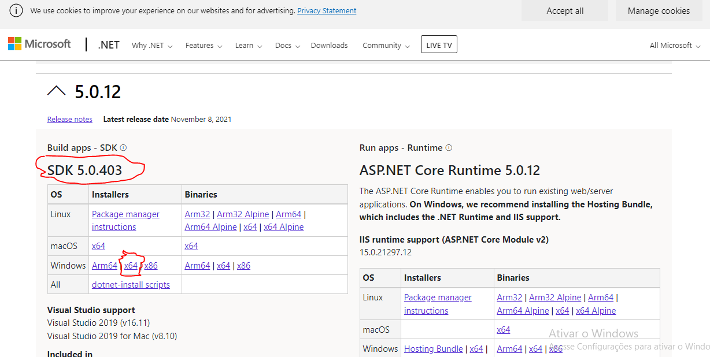
        

- Está atualmente na versão 5, mas já está falando da versão 6. É multiplataforma de plataforma de codigo aberto e tem suporte para o c#.
- Para criar um projeto c# com suporte para .NET tem-se que fazer os seguintes passos:
    - Ao abrir o visual studio 2019, deve-se clicar na opção "Criar um projeto":
        
        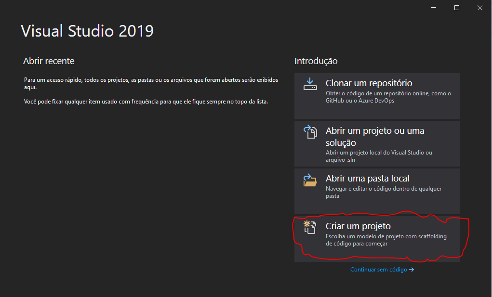
        
    - Em seguida deve-se clicar para criar um "aplicativo de console" em c# e clicar em "próximo":
        
        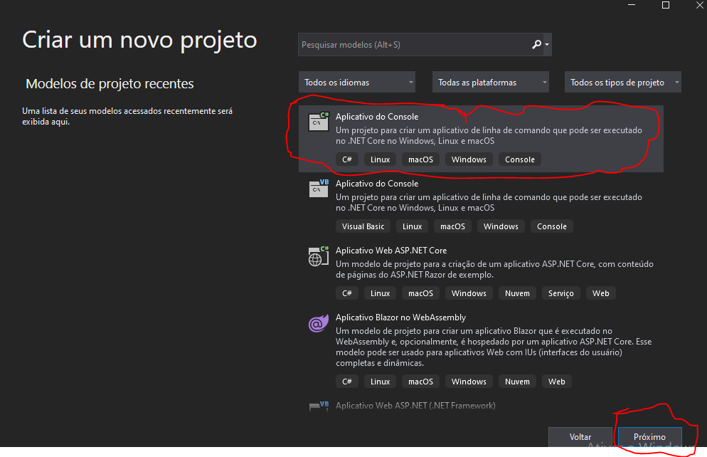
        
    - Deve-se definir o nome do projeto e depois clicar em próximo:
        
        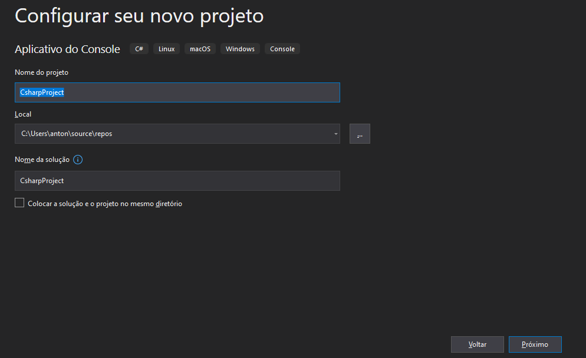
        
    - Em seguida tem-se que escolher o .NET da versão 5 (o mais atual e estável) e clicar em criar:
        
        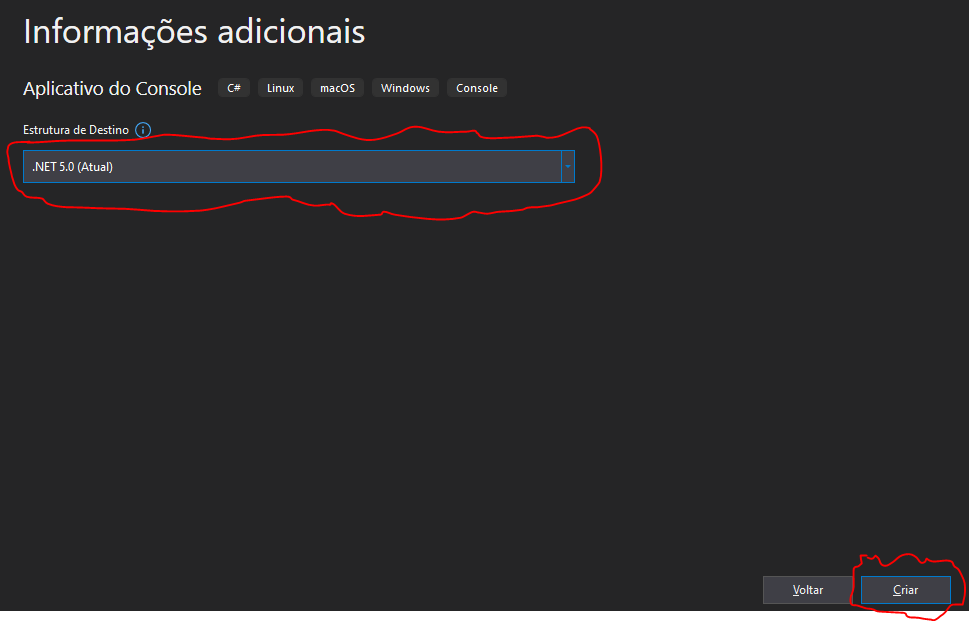
        
    - Agora, deve-se esperar a criação do projeto:
        
        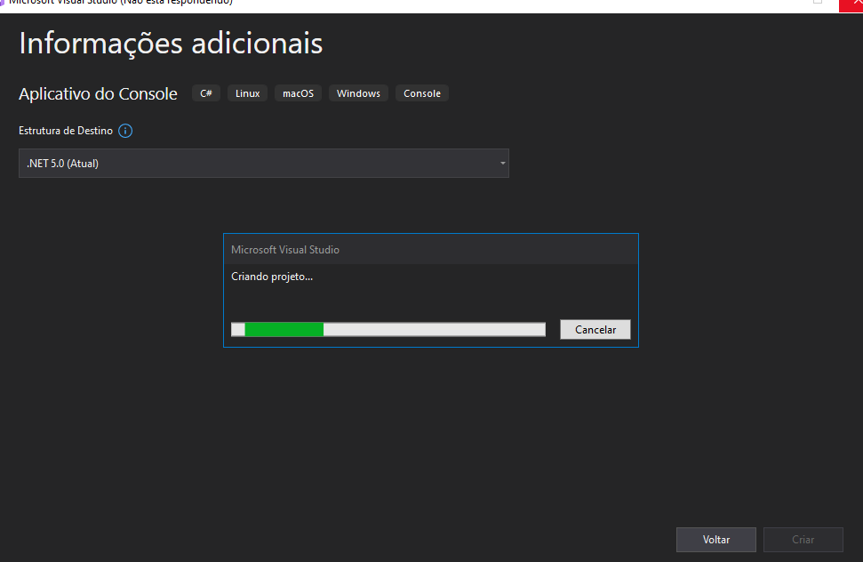
        
    - Caso o projeto seja criado com êxito, essa deve ser a visão mostrada:
        
        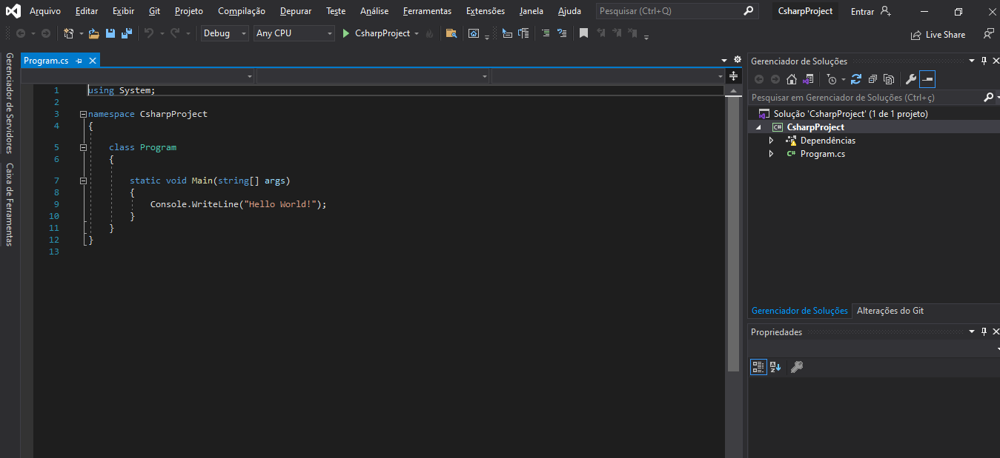
        
    - Basicamente esse escopo apresentado é composto por um "namespace" que será o nome do projeto, como se fosse um 'empacotador' (definido no Bloco A da figura); esse "namespace" terá classe que podem representar nosso objeto (definido no Bloco A da figura); basicamente toda aplicação de console log terá um método estático (static) chamado "Main" (definido no Bloco C da figura). Além disso, pode-se observar uma árvore no "Gerenciador de Soluções", nele pode-se acessar diversas configurações do projeto além de uma visualização macro do projeto (definido no Bloco D da figura). Por fim, para validar a criação do projeto, pode-se executar o programa (definido no Bloco E da figura) cuja mensagem que será apresentada em um prompt de comando está definida dentro da classe "Main"(definido no Bloco C da figura).
        
        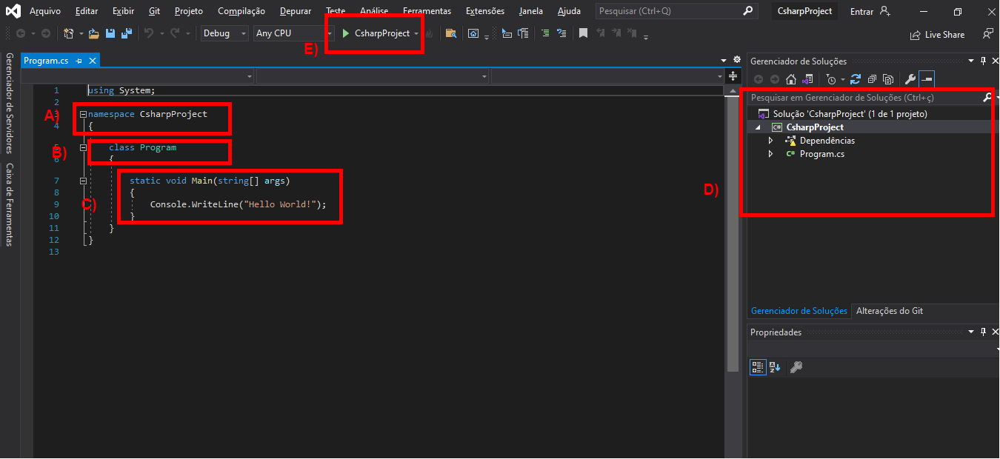
        
    - Feito isso, a tela que deve ser apresentada tem que ser semelhante à tela mostrada abaixo com a mensagem de "Hello world" em um prompt de comando:
        
        
        
    - Vale salientar a importância de entender o que está sendo feito. Para isso pode-se navegar para a pasta do projeto ao clicar com o botão direito do mouse sobre o projeto no "Gerenciado de Soluções" (definido no Bloco A da figura abaixo), das opções que aparecem (definido no Bloco B da figura abaixo) escolher a opção "Abrir pasta no Gerenciador de Arquivos" (definido no Bloco C da figura abaixo).
        
        
        
    - Ao fazer isso, o projeto criado será aberto no Gerenciador de Arquivos do windows, e ao navegar para o caminho "bin\Debug\net5.0\" pode-se observar os arquivos Assembly gerados pela compilação, como mostrados na figura abaixo:
        
        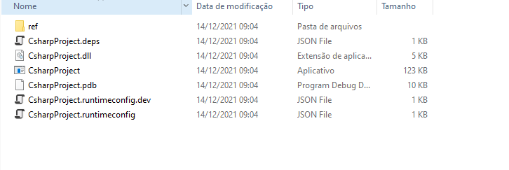
        
    - 
    -